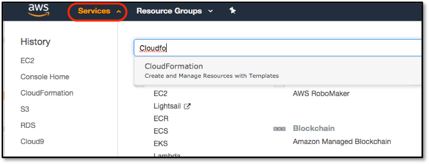
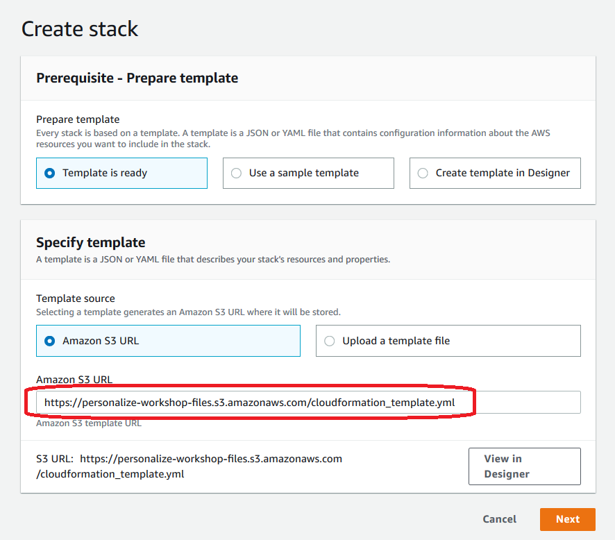
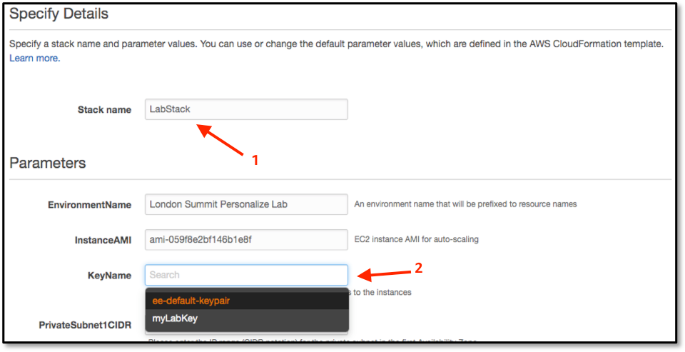
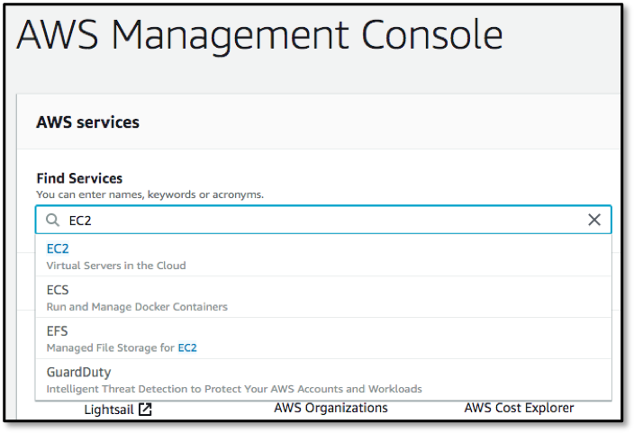
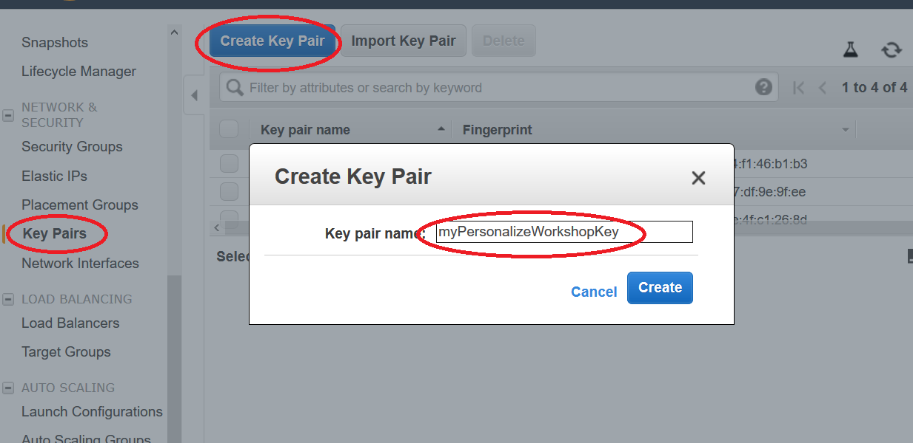

# Building a Movie Recommendation Engine using Amazon Personalize

[Amazon Personalize](https://aws.amazon.com/personalize/) is a machine learning service that makes it easy for developers to create individualized recommendations for customers using their applications.

Machine learning is being increasingly used to improve customer engagement by powering personalized product and content recommendations, tailored search results, and targeted marketing promotions. However, developing the machine learning capabilities necessary to produce these sophisticated recommendation systems has been beyond the reach of most organizations today due to the complexity of developing machine learning functionality. Amazon Personalize allows developers with no prior machine learning experience to easily build sophisticated personalization capabilities into their applications, using machine learning technology perfected from years of use on Amazon.com.

## Prerequisites for the Workshop

- Sign up for an AWS account
- [Create a Cloud9 Workspace](#1-create-a-cloud9-workspace) - you want to do this step if you are using windows based computer and do not wish to use Putty and PuttyGen to SSH into the EC2 instance that hosts the website. 
- [Installs and Configs](#2-installs-and-configs) - If you were creating a Cloud9 envrionment to SSH into EC2, go through this step also.
- If you are a Mac or Linux user, then no need to go through the previous 2 steps. But create a KeyPair on EC2 console. Steps are described [here](#3-create-a-keypair-on-ec2-console).

## Workshop Roadmap

/play vuvuzela► 

:warning: **This workshop works ONLY in us-east-1**

- [Overview](#overview)
- [Deploy the skeleton Web App](#deploy-the-app)
- [Launch Jupyter Notebook on Amazon SageMaker](https://github.com/rumiio/recommendation-using-Personalize/tree/master/notebook#launch-jupyter-notebook-on-amazon-sagemaker)
- Create components of Amazon Personalize for movie recommendation, using the notebook.  
- (Optional) Build Item-to-Item Recommendations using Amazon Personalize
- (Optional) Build Personal Ranking using Amazon Personalize
- Setup Web App Configuration on Amazon EC2
- Shutting Down
- Conclusion

## Overview

This lab will walk you through the following:
- Deploy and configure a Video Recommendation application
- Setting up a Jupyter Notebook environment to interact with Amazon Personalize
- Downloading and preparing training data, based on the Movie Lens dataset
- Importing prepared data into Amazon Personalize
- Building an ML model based upon the Hierarchical Recurrent Neural Network (HRNN) algorithm
- Testing your model by deploying an Amazon Personalize campaign
- Adding your campaign to the Video Recommendation application

## Deploy the App

1. Click on the **Services** dropdown and select **CloudFormation** from the list of all services by entering CloudFormation into the Find services box. This will bring you to the Amazon CloudFormation console home page.

    

 1. We are going to deploy a pre-built application via a CloudFormation template - this will be a fully-functioning recommendation system, allowing access to multiple Amazon Personalize features. But it has one drawback - there are no models built into it! So we will create them in this lab, and when they are ready we will re-configure this application to use them. 
 
    First, we’ll deploy this skeleton application by clicking on the **Create Stack** button to start the deployment wizard, and in the **Specify template** section, enter the below link to Amazon S3 URL. Then click on Next.

    https://personalize-workshop-files.s3.amazonaws.com/cloudformation_template.yml   

    

1. The next screen asks for more configuration parameters, but only two of these are required: **Stack name** and **KeyName**. For Stack name enter something simple, such as *PersonalizeLabStack*, and select your previously-defined EC2 kay-pair, then click Next (not shown).

    

1. There will then be two additional screens. The first is called *Options*, but we have none to enter, so just click on **Next**. The second is the final Review screen - **please verify** that the **KeyName** is the one that you just downloaded, and then click on **Create**. 

    This will then go and create the environment, which will take around 10 minutes. Once the console returns to the main CloudFormation screen, you can continue with the next lab step, which is to create a Jupyter Notebook environment in AmazonSageMaker. 


# Prerequisites

**Make sure you have the environment setup for the latter part of the workshop by going through this section.**

- **For Windows User** - go through Step 1 and Step 2 **if** you are not using Putty and PuttyGen for your SSH access to the EC2 instance. If you are using Putty and PuttyGen, you don't need to go through Step 1 nor Step 2 but you still need to do Step 3. 

- **For Mac or Linux User** - skip ahead to Step 3. 

## 1. Create a Cloud9 Workspace

AWS Cloud9 is a cloud-based integrated development environment (IDE) that lets you write, run, and debug your code with just a browser. It includes a code editor, debugger, and terminal. Cloud9 comes prepackaged with essential tools for popular programming languages, including JavaScript, Python, PHP, and more, so you don’t need to install files or configure your development machine to start new projects.

The Cloud9 workspace should be built by an IAM user with Administrator privileges,not the root account user. Please ensure you are logged in as an IAM user, not the root account user.

Charges begin accruing immediately so consider creating a Billing Alarm by following the instructions [here](https://docs.aws.amazon.com/AmazonCloudWatch/latest/monitoring/monitor_estimated_charges_with_cloudwatch.html).
Ad blockers, JavaScript disablers, and tracking blockers should be disabled for the cloud9 domain, otherwise connecting to the workspace might be impacted. 

### Create a new environment

1. Go to the [Cloud9 web console](https://us-east-1.console.aws.amazon.com/cloud9/home?region=us-east-1#)
1. Select **Create environment**
1. Name it **Workshop**, and go to the **Next step**
1. Select **Create a new instance for environment (EC2)** and pick ```t2.medium``` from **Other instance type** dropdown list.
1. Leave all of the environment settings as they are, and go to the **Next step**
1. Click **Create environment**

This setup could take a few minutes. 

### Clean up the layout

When the environment comes up, customize the layout by closing the welcome tab and lower work area, and opening a new terminal tab in the main work area.

Optional: If you like this theme, you can choose it yourself by selecting View / Themes / Solarized / Solarized Dark in the Cloud9 workspace menu.


## 2. Installs and Configs

Before we begin coding, there are a few things we need to install, update, and configure in the Cloud9 environment.

### Installing and updating

In the Cloud9 terminal, run the following commands to install and update some software we’ll be using for this workshop:

```
pip install --user --upgrade awscli
```

### Configuring a default region

A best practice is to deploy your infrastructure close to your customers, let’s configure a default AWS region for this workshop : Oregon (us-west-2) or Northern Virginia (*us-east-1*) for North America.

You can run below command to see but as a default, it should have set the region where your created Cloud9 environment. 

```
aws configure
```

### Create an EC2 KeyPair

Creating an SSH KeyPair will allow us to connect to other EC2 instances from our cloud9 machine.

Let’s run this command in our terminal:

```
aws ec2 create-key-pair --key-name PersonalizeWorkshop --query 'KeyMaterial' --output text > PersonalizeWorkshop.pem
```

That will create a new private key on our machine, in PersonalizeWorkshop.pem, and a public key for EC2 to manage. For security reasons we’ll change the permissions on the PersonalizeWorkshop.pem file so that only we can read it.

```
chmod 400 PersonalizeWorkshop.pem
```

Now we can start an ssh-agent running the background that can manage our keys and connections for us.

```
eval `ssh-agent -s`
ssh-add PersonalizeWorkshop.pem
```

If it asks for a passphrase you can include one or leave it blank and just press enter.

## 3. Create a KeyPair on EC2 Console. 

1. The application will run on an EC2 instance, but at some point we will need to connect to the server in order to carry out some configuration task. To do this we need to have an EC2 Key Pair configured on the server that you also have access to on your computer; hence, we need to create and download a new one. Click on EC2 from the list of all services by entering EC2 into the Find services box. This will bring you to the Amazon EC2 console home page.

    

1. On the left-hand menu scroll down until you see Key Pairs and select it, and in the resulting dialog click on the Create Key Pair button. This will bring up a Create Key Pair dialog, where you need to enter the name of a new key pair - call it myPersonalizeWorkshopKey and hit Create. This should automatically download the file, or you may need to manually do so.

    