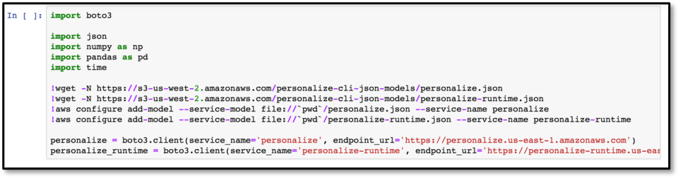
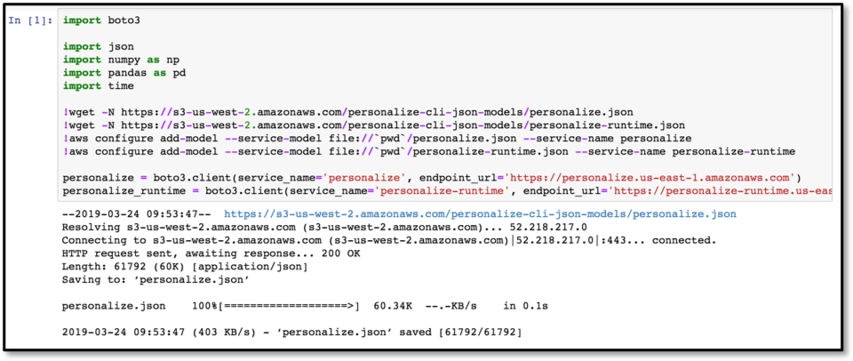

# Building a Movie Recommendation Engine using Amazon Personalize

In the previous section, you have setup an environment to use for the rest of the workshop. You also have deployed a pre-built, skeleton web application via a CloudFormation template.

From here, we will get into the meat of the workshop where you will be using 2 of the AWS managed Machine Learning serivce, Amazon SageMaker and Amazon Personalize.

## Workshop Roadmap (continued)

- Overview
- Deploy the skeleton Web App
- [Launch Jupyter Notebook environment on Amazon SageMaker](#launch-jupyter-notebook-on-amazon-sagemaker)
- Using the notebook, [create components of Amazon Personalize for movie recommendation](#using-the-notebook-create-components-of-amazon-personalize-for-movie-recommendation).  
- (Optional) Build Item-to-Item Recommendations using Amazon Personalize
- (Optional) Build Personal Ranking using Amazon Personalize
- Setup Web App Configuration
- Shutting Down
- Conclusion

## Launch Jupyter Notebook Environment on Amazon SageMaker

1. Click on **Amazon SageMaker** from the list of all services by entering Sagemaker into the **Find services** box. This will bring you to the Amazon SageMaker console homepage. 

1. To create a new Jupyter notebook instance, go to **Notebook instances** in the Amazon SageMaker console, and click the **Create notebook instance** button at the top of the browser window.

    

1. Type *Personalize-Workshop* into the **Notebook instance name** text box, and then *ml.m5.2xlarge* into the **Notebook instance type**. Note, for this lab the majority of the work is performed by the Amazon Personalize service, so there is not need to launch a large, compute-optimized C5 or GPU-based instance type.

    

    On the **Permission and encryption** section of the same page, choose **Create a new role** from the dropdown list. It will bring up the following popup window. Here, you can specify your S3 bucket or choose *Any S3 bucket* if you don't have S3 bucket created yet. For security purposes, we always recommend to choose *Specific S3 bucket* option but for the purpose of the lab, you could choose *Any S3 bucket*.  

    

    Lastly on this wizard, scroll down to the **Git repositories** section and choose *Clone a public Git repository to this notebook instance only* option. Then enter the URL of this workshop as shown below. Click on **Create notebook instance** button. 

    https://github.com/rumiio/recommendation-using-Personalize   

    

    Wait until the notebook instance status is **InService**. This will take a few minutes once the creation process has started. Then click on **Open Jupyter**.

    

## Using the Notebook, Create Components of Amazon Personalize for Movie Recommendation.  

1. A notebook consists of a number of cells; in SageMaker these will typically either be Code or Markdown cells. Markdown is used to allow for documentation to be defined inline with the code, giving the author a rich set of markdown formatting options. The first cell in this notebook, which is called **Get the Personalize boto3 Client**, is Markdown, and if you select any cell then the whole cell is highlighted.

    

1. The first Markdown cell describes what the following Code cell is going to do – for the sake of this lab you do not have to understand the code that is being run in the Code cell, rather you should just appreciate what the notebook is doing and how you interact with a Jupyter notebook.

    

1. To the left of a Code module is a set of empty braces **\[ \]**. By highlighting the cell and then selecting the Run command in the menu bar, the Jupyter notebook will execute this code, outputting and code outputs to the notebook screen and keeping any results data internally for re-use in future steps. Do this now to execute the first code cell.

    *Note: if a Markdown cell is highlighted, then clicking **Run** will move the highlight to the next cell*

1. While the code is executing the braces will change to be **\[*\]**, indicating that it is executing, and once complete will change to **\[1\]**. Future cells will have increasing numbers inside the braces, and this helps you see the order in which cells have been exected within the notebook. Directly below the code, but still within the Code cell, is the output from the code execution - this will include any error messages that your code has thrown.

    

1. Now please continue to work through the notebook lab - read the comments prior to each Code cell in order to get an understanding as to what is going on, as these explain why we are doing each step and how it ties in to using the Amazon Personalize service.

## Setup Web App Configuration