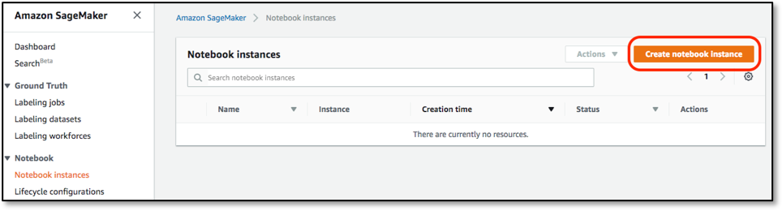
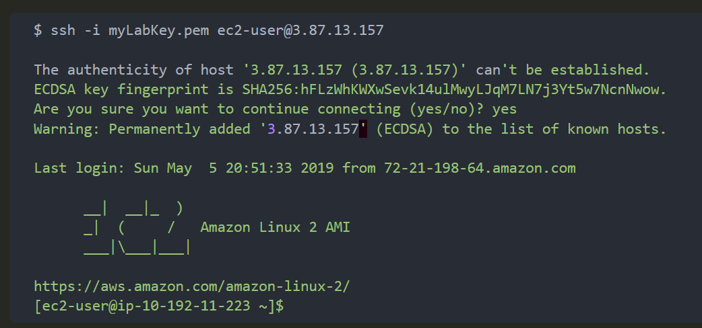
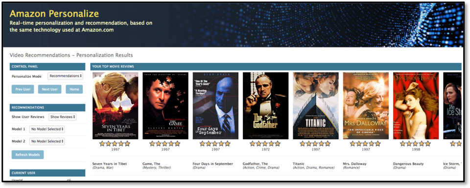

# Building a Movie Recommendation Engine using Amazon Personalize

In the previous section, you have setup an environment to use for the rest of the workshop. You also have deployed a pre-built, skeleton web application via a CloudFormation template.

From here, we will get into the meat of the workshop where you will be using 2 of the AWS managed Machine Learning serivce, Amazon SageMaker and Amazon Personalize.

## Workshop Roadmap (continued)

- Overview
- Deploy the skeleton Web App
- [Launch Jupyter Notebook environment on Amazon SageMaker](#launch-jupyter-notebook-on-amazon-sagemaker)
- Using the notebook, [create components of Amazon Personalize for movie recommendation](#using-the-notebook-create-components-of-amazon-personalize-for-movie-recommendation).  
- (Optional) Build Item-to-Item Recommendations using Amazon Personalize
- (Optional) Build Personal Ranking using Amazon Personalize
- Setup Web App Configuration
    - Django Framework Config
    - Plug in Models
    - (Optional) Additional Campaigns
- Shutting Down
- Conclusion


## Launch Jupyter Notebook Environment on Amazon SageMaker

1. Click on **Amazon SageMaker** from the list of all services by entering Sagemaker into the **Find services** box. This will bring you to the Amazon SageMaker console homepage. 

1. To create a new Jupyter notebook instance, go to **Notebook instances** in the Amazon SageMaker console, and click the **Create notebook instance** button at the top of the browser window.

    

1. Type *Personalize-Workshop* into the **Notebook instance name** text box, and then *ml.m5.2xlarge* into the **Notebook instance type**. Note, for this lab the majority of the work is performed by the Amazon Personalize service, so there is not need to launch a large, compute-optimized C5 or GPU-based instance type.

    

    On the **Permission and encryption** section of the same page, choose **Create a new role** from the dropdown list. It will bring up the following popup window. Here, you can specify your S3 bucket or choose *Any S3 bucket* if you don't have S3 bucket created yet. For security purposes, we always recommend to choose *Specific S3 bucket* option but for the purpose of the lab, you could choose *Any S3 bucket*.  

    

    Lastly on this wizard, scroll down to the **Git repositories** section and choose *Clone a public Git repository to this notebook instance only* option. Then enter the URL of this workshop as shown below. Click on **Create notebook instance** button. 

    https://github.com/rumiio/recommendation-using-Personalize   

    

    Wait until the notebook instance status is **InService**. This will take a few minutes once the creation process has started. Then click on **Open Jupyter**.

    


## Using the Notebook, Create Components of Amazon Personalize for Movie Recommendation.  

1. A notebook consists of a number of cells; in SageMaker these will typically either be Code or Markdown cells. Markdown is used to allow for documentation to be defined inline with the code, giving the author a rich set of markdown formatting options. The first cell in this notebook, which is called **Get the Personalize boto3 Client**, is Markdown, and if you select any cell then the whole cell is highlighted.

    

1. The first Markdown cell describes what the following Code cell is going to do – for the sake of this lab you do not have to understand the code that is being run in the Code cell, rather you should just appreciate what the notebook is doing and how you interact with a Jupyter notebook.

    

1. To the left of a Code module is a set of empty braces **\[ \]**. By highlighting the cell and then selecting the Run command in the menu bar, the Jupyter notebook will execute this code, outputting and code outputs to the notebook screen and keeping any results data internally for re-use in future steps. Do this now to execute the first code cell.

    *Note: if a Markdown cell is highlighted, then clicking **Run** will move the highlight to the next cell*

1. While the code is executing the braces will change to be **\[*\]**, indicating that it is executing, and once complete will change to **\[1\]**. Future cells will have increasing numbers inside the braces, and this helps you see the order in which cells have been exected within the notebook. Directly below the code, but still within the Code cell, is the output from the code execution - this will include any error messages that your code has thrown.

    

1. Now please continue to work through the notebook lab - read the comments prior to each Code cell in order to get an understanding as to what is going on, as these explain why we are doing each step and how it ties in to using the Amazon Personalize service.


# Setup Web App Configuration

## Django Framework Config

There are various components within the application that need some final configuration. The basics, such as the VPC, the Application Load Balancer, the Auto-Scaling Group and resultant EC2 images, are all good to go, but some configuration is necessary on the Django application framework that is hosting the application. This needs to be done by connecting into the instance using SSH.

There are many ways to connect to a remote machine using SSH. Feel free to follow the instructions from the prerequisites. This Lab Guide will continue with using SSH at the command line on an Apple Mac computer - your own method for establishing a connection may be different, but once connected the instructions are the same regardless of your platform combination.

1. In order to connect you need to have your downloaded key-pair from earlier in an accessible location. It also must not be publicly readable, so if you are on a Mac or Linux system you can fix this with the following command, remembering to replace **myPersonalizeWorkshopKey.pem** with your key name!

    ```
    chmod 400 myPersonalizeWorkshop.pem
    ```
 1. Go to the the EC2 console page, go to the **Instances** menu on the left, and find your one running instance. Select it, and make a note of (or copy) the **IPv4 Public IP** for your instance.

     

1. Go to your computer CLI, and navigate to the directory containing your key-pair. Issue the following command to connect via SSH, changing the key-pair filename and IP address as necessary, and you should see results similar to what follows. You will see a warning about the authenticity of the host then just enter **yes** at the prompt.

     

1. Navigate to the root of the Django project, and configure the single-line run script to use the private IP address of the EC2 instance. This is on the previous EC2 details screen just underneath the Public IP - you will need this again, so keep it handy. Simply replace the IP address with yours, keeping the trailing **:8000** - my server’s private IP is 10.192.11.223.

    ```
    $ cd personalize-video-recs/videorecs/
    $ nano runmyserver
    --- {editor screen} ---
    python manage.py runserver 10.192.11.223:8000
    ```

1. Django only allows access via pre-defined source IP addresses. Naturally, these could be open to the internet, but they recommend only exposing it the instance private IP address (for internal calls) and to your front-end load balancer. You already have a reference to the private IP address, so you now need to extract the Load Balancer DNS entry. Go back to the EC2 console screen, but this time select **Load Balancers** on the left-hand menu; select your Application Load Balancer and in the details screen that comes up select the DNS name and store it for later. 

     

1. While we’re collecting data, move to the **Amazon RDS** service section of the console, select **Databases** from the left-hand menu and select the Lab database called **summitpersonalizelab** from the list. In the details screen copy the DNS endpoint for the database and store it for later.

     

1. Go back to your SSH session window. You now need to edit two entries in the file - one is called **ALLOWED_HOSTS** and the other is **HOST** entry in the **DATABASES** section. Edit the file, then in the editor window find the two relevant lines and edit them so that they look like that shown below, but with your IP and DNS entries

    ```
    $ nano videorecs/settings.py
    --- {ALLOWED_HOSTS line - server private IP and ALB DNS} ---

    ALLOWED_HOSTS = ['10.192.11.151', 'TestS-Appli-ADS60FMCKPMG-1862985075.us-east-1.elb.amazonaws.com']

    --- {DATABASES HOSTS line - RDS DNS} ---

        'HOST': 'summitpersonalizelab.c0azewoaia5d.us-east-1.rds.amazonaws.com',
    ```

1. Finally, the RDS database is postgres, and we have included the **pgcli** tool with this deployment. If you wish to use it then you need to edit the startup script for the utility to point to the RDS DNS entry. You also need to know the password, which you may have noticed in the **settings.py** file, and it’s **recPassw0rd**

    ```
    $ nano pgcli
    --- {editor screen} ---
    /home/ec2-user/.local/bin/pgcli -h summitpersonalizelab.c0azewoaia5d.us-east-1.rds.amazonaws.com -u vidrecdemo -d videorec
    ```

1. You are now ready to run the application server! Simply execute the **runmyserver** script, and you should see status messages appearing quickly - these initial ones are the Load Balancer health-checks, and after a minute or so the instance should be declared healthy by the Load Balancer Target Group. Note, you will see some warnings around the psycopg2 component, but this can be ignored.

    ```
    $ ./runmyserver

    System check identified no issues (0 silenced).
    May 06, 2019 - 14:53:03
    Django version 1.11.18, using settings 'videorecs.settings'
    Starting development server at http://10.192.11.223:8000/
    Quit the server with CONTROL-C.
    [06/May/2019 14:53:14] "GET /recommend/ HTTP/1.1" 200 2893
    [06/May/2019 14:53:32] "GET /recommend/ HTTP/1.1" 200 2893
    [06/May/2019 14:53:44] "GET /recommend/ HTTP/1.1" 200 2893
    ```

1. The URL of the server is your ALB followed by the ‘/recommend/’ path, although there is also an ‘/admin/’ path that we’ll use later. For now connect to your server - in my example the server can be found at 

    http://TestS-Appli-ADS60FMCKPMG-1862985075.us-east-1.elb.amazonaws.com/recommend

1. You should see the following screen in your browser - no Model Precision Metrics are available, as we haven’t added any models yet to the application. You can also see that documentation for this is present, but be aware that it may not be 100% up to date with coding changes on the demo.

     

1. If you hit **Select Random User** then you’ll be taken to the main Recommendation screen, which starts by showing you a random user’s top-25 movie review titles. However, you’ll see on the Model dropdown on the left that there are no models available, and if you change the Personalize Mode to either Personal Ranking or Similar Items then it’s the same story - you can see the movie reviews, and most-popular titles in a genre, but no recommendations. We need to get the solutions and campaigns built in the notebook, then you can come back and plug in the models.

     


## Plug in Models

The application uses the Django Administration feature to define models that are available to the application. This allows multiple models of different types to be configured, and injected or removed from the application at any time. There are three modes of operation of the application: